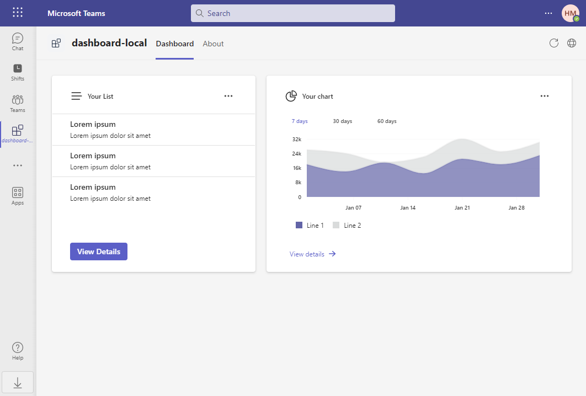
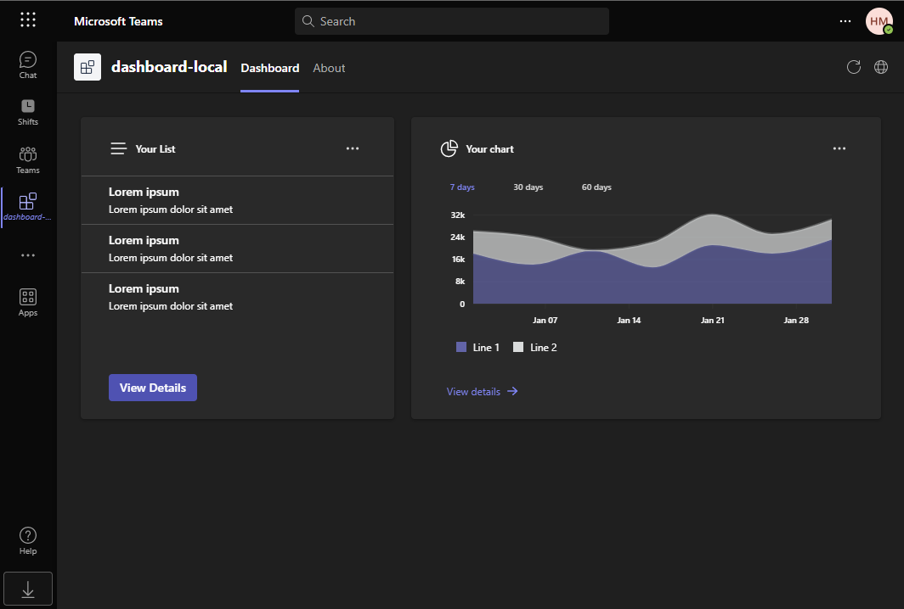
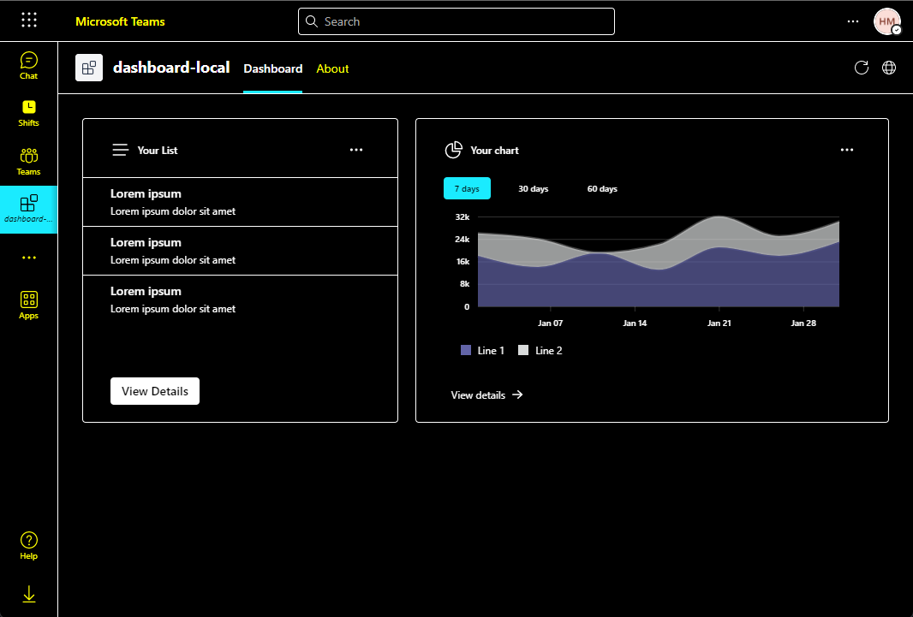

# Dashboard Tab

## Introduction

This is a dashboard tab app that embed a canvas containing multiple cards that provide an overview of data or content in Microsoft Teams.



This app also supported teams different themes, including dark theme and high contrast theme.

|            Dark theme            |      High contrast theme       |
| :------------------------------: | :----------------------------: |
|  |  |

## Prerequisites

- [Node.js](https://nodejs.org/), supported versions: 16, 18
- A Microsoft 365 account. If you do not have Microsoft 365 account, apply one from [Microsoft 365 developer program](https://developer.microsoft.com/en-us/microsoft-365/dev-program)
- [Teams Toolkit Visual Studio Code Extension](https://aka.ms/teams-toolkit) version 5.0.0 and higher or [TeamsFx CLI](https://aka.ms/teamsfx-cli)

## Getting Started

Run your app with local debugging by pressing `F5` in VSCode. Select `Debug (Edge)` or `Debug (Chrome)`.

**Congratulations**! You are running an application that can now show a dashboard in Teams.

## Understanding the code

This section walks through the generated code. The project folder contains the following:

| Folder       | Contents                                            |
| ------------ | --------------------------------------------------- |
| `.vscode`    | VSCode files for debugging                          |
| `appPackage` | Templates for the Teams application manifest        |
| `env`        | Environment files                                   |
| `infra`      | Templates for provisioning Azure resources          |
| `src`        | The source code for the dashboard Teams application |

The following files provide the business logic for the dashboard tab. These files can be updated to fit your business logic requirements. The default implementation provides a starting point to help you get started.

| File                                 | Contents                                           |
| ------------------------------------ | -------------------------------------------------- |
| `src/services/chartService.js`       | A data retrive implementation for the chart widget |
| `src/services/listService.js`        | A data retrive implementation for the list widget  |
| `src/dashboards/SampleDashboard.jsx` | A sample dashboard layout implementation           |
| `src/styles/ChartWidget.css`         | The chart widget style file                        |
| `src/styles/ListWidget.css`          | The list widget style file                         |
| `src/widgets/ChartWidget.jsx`        | A widget implementation that can display a chart   |
| `src/widgets/ListWidget.jsx`         | A widget implementation that can display a list    |
| `src/App.css`                        | The style of application route                     |
| `src/App.jsx`                        | Application route                                  |

The following files are project-related files. You generally will not need to customize these files.

| File                               | Contents                                                     |
| ---------------------------------- | ------------------------------------------------------------ |
| `src/index.css`                    | The style of application entry point                         |
| `src/index.jsx`                    | Application entry point                                      |
| `src/internal/addNewScopes.js`     | Implementation of new scopes add                             |
| `src/internal/context.jsx`         | TeamsFx Context                                              |
| `src/internal/login.js`            | Implementation of login                                      |
| `src/internal/singletonContext.js` | Implementation of the TeamsUserCredential instance singleton |

## How to add a new widget

You can use the following steps to add a new widget to the dashboard:

1. [Step 1: Create a data retrive service](#step-1-create-a-data-retrive-service)
2. [Step 2: Create a widget file](#step-2-create-a-widget-file)
3. [Step 3: Add the widget to the dashboard](#step-3-add-the-widget-to-the-dashboard)

### Step 1: Create a data retrive service

Typically, a widget requires a service to retrieve the necessary data for displaying its content. This service can either fetch static data from a predefined source or retrieve dynamic data from a backend service or API.

For instance, we will implement a service that returns static data and place under the `src/services` directory.

Here is a sample service for retrieving static data:

```javascript
//sampleService.js
export const getSampleData = () => {
  return { content: "Hello world!" };
};
```

### Step 2: Create a widget file

Create a widget file in `src/widgets` folder. Inherit the `BaseWidget` class from `@microsoft/teamsfx-react`. The following table lists the methods that you can override to customize your widget.

| Methods     | Function                                                                                                                                      |
| ----------- | --------------------------------------------------------------------------------------------------------------------------------------------- |
| `getData()` | This method is used to get the data for the widget. You can implement it to get data from the backend service or from the Microsoft Graph API |
| `header()`  | Customize the content of the widget header                                                                                                    |
| `body()`    | Customize the content of the widget body                                                                                                      |
| `footer()`  | Customize the content of the widget footer                                                                                                    |
| `styling()` | Customize the widget style                                                                                                                    |

> All method overrides are optional.

Here's a sample widget implementation:

```javascript
//SampleWidget.jsx
import { Button, Text } from "@fluentui/react-components";
import { BaseWidget } from "@microsoft/teamsfx-react";
import { getSampleData } from "../services/sampleService";

export class SampleWidget extends BaseWidget {
  async getData() {
    return getSampleData();
  }

  header() {
    return <Text>Sample Widget</Text>;
  }

  body() {
    return <div>{this.state.data?.content}</div>;
  }

  footer() {
    return <Button>View Details</Button>;
  }
}
```

### Step 3: Add the widget to the dashboard

Open the `src/dashboards/SampleDashboard.jsx` file and add the widget to the implementation of the `layout` method. If you want create a new dashboard, please refer to [How to add a new dashboard](#how-to-add-a-new-dashboard).

```jsx
layout() {
  return (
    <>
      <ListWidget />
      <ChartWidget />
      <SampleWidget />
    </>
  );
}
```

Optional: If you want to arrange multiple widgets in the same column, you can refer to the following code snippet:

```css
.one-column {
  display: grid;
  gap: 20px;
  grid-template-rows: 1fr 1fr;
}
```

```jsx
layout() {
  return (
    <>
      <ListWidget />
      <div className="one-column">
        <ChartWidget />
        <SampleWidget />
      </div>
    </>
  );
}
```

## How to add a new dashboard

You can use the following steps to add a new dashboard:

1. [Step 1: Create a dashboard class](#step-1-create-a-dashboard-class)
2. [Step 2: Override methods to customize dashboard layout](#step-2-override-methods-to-customize-dashboard-layout)
3. [Step 3: Add a route for the new dashboard](#step-3-add-a-route-for-the-new-dashboard)
4. [Step 4: Modify manifest to add a new dashboard tab](#step-4-modify-manifest-to-add-a-new-dashboard-tab)

### Step 1: Create a dashboard class

Create a file with the extension `.jsx` for your dashboard in the `src/dashboards` directory, for example, `YourDashboard.jsx`. Then, define a class that inherits the `BaseDashboard` class from `@microsoft/teamsfx-react`.

```javascript
//YourDashboard.jsx
import { BaseDashboard } from "@microsoft/teamsfx-react";

export default class YourDashboard extends BaseDashboard {}
```

### Step 2: Override methods to customize dashboard layout

The `BaseDashboard` class provides some methods that you can override to customize the dashboard layout. The following table lists the methods that you can override.

| Methods     | Function                             |
| ----------- | ------------------------------------ |
| `styling()` | Customize the style of the dashboard |
| `layout()`  | Define widgets layout                |

Here is an example to customize the dashboard layout.

```css
.your-dashboard-layout {
  grid-template-columns: 6fr 4fr;
}
```

```tsx
import { BaseDashboard } from "@microsoft/teamsfx-react";
import ListWidget from "../widgets/ListWidget";
import ChartWidget from "../widgets/ChartWidget";

export default class YourDashboard extends BaseDashboard {
  styling() {
    return "your-dashboard-layout";
  }

  layout() {
    return (
      <>
        <ListWidget />
        <ChartWidget />
      </>
    );
  }
}
```

### Step 3: Add a route for the new dashboard

Open the `src/App.jsx` file, and add a route for the new dashboard. Here is an example:

```jsx
import YourDashboard from "./dashboards/YourDashboard";

export default function App() {
  ...
   <Route path="/yourdashboard" element={<YourDashboard />} />
  ...
}
```

### Step 4: Modify manifest to add a new dashboard tab

Open the [`appPackage/manifest.json`](appPackage/manifest.json) file, and add a new dashboard tab under the `staticTabs`. Here is an example:

```json
{
  "entityId": "index1",
  "name": "Your Dashboard",
  "contentUrl": "${{TAB_ENDPOINT}}/index.html#/yourdashboard",
  "websiteUrl": "${{TAB_ENDPOINT}}/index.html#/yourdashboard",
  "scopes": ["personal"]
}
```

## How to add a new Graph API call

Please follow these two steps:

1. Add SSO: Refer to How-to guides in Teams Toolkit by clicking Teams Toolkit in the side bar > `View how-to guides` > `Develop single sign-on experience in Teams`.
2. Refer to [this document](https://learn.microsoft.com/en-us/microsoftteams/platform/toolkit/teamsfx-sdk#microsoft-graph-scenarios:~:text=caught%20and%20transformed.-,Microsoft%20Graph%20Scenarios,-This%20section%20provides) to call a Graph API via TeamsFx SDK.

## Additional resources

- [Fluent UI](https://react.fluentui.dev/?path=/docs/concepts-introduction--page)
- [Fluent UI React Charting Example](https://fluentuipr.z22.web.core.windows.net/heads/master/react-charting/demo/index.html#/)
